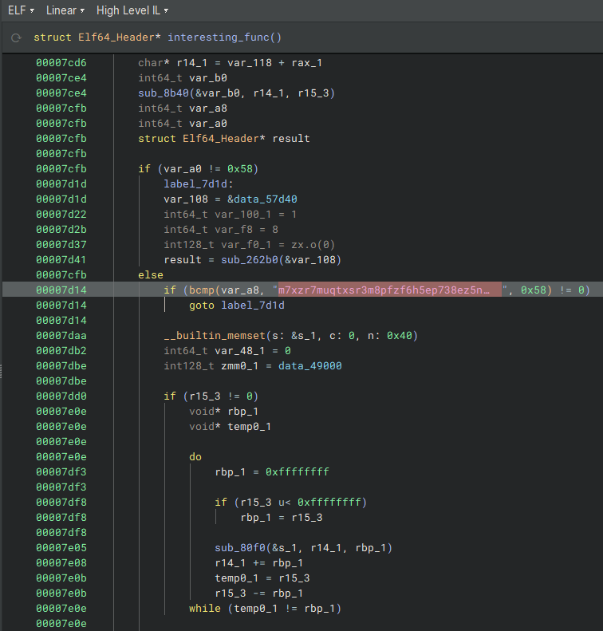
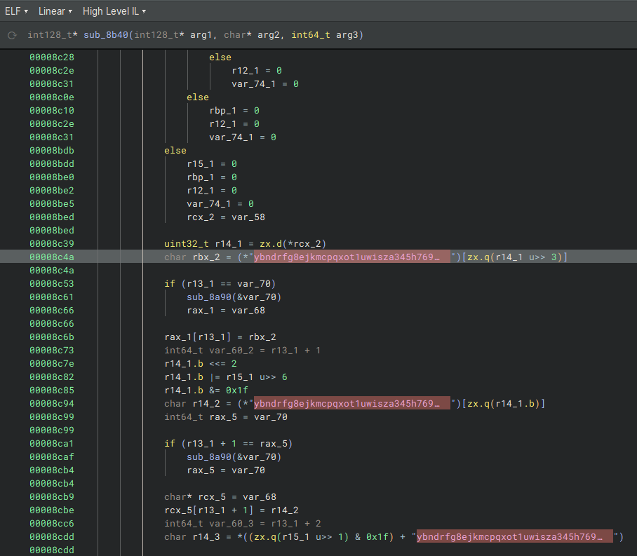

## Overview

We were given a Rust binary to analyze. After inspecting it, we found two interesting strings embedded in the binary.

---

## 1. Encoded String

We found the following long string in the binary (see image below):



```
m7xzr7muqtxsr3m8pfzf6h5ep738ez5ncftss7d1cftskz49qj4zg7n9cizgez5upbzzr7n9cjosg45wqjosg3muInvalid password!
Congratulations! flag{
```

The part before `"Invalid password!"` looked like encoded data.

---

## 2. Custom Alphabet

We also found what looked like a custom Base32 alphabet (see image below):



```
ybndrfg8ejkmcpqxot1uwisza345h769
```

It has 32 characters, which is exactly what’s needed for a Base32 alphabet.

---

## Decoding the Message

We wrote a Python script to decode the string using this custom alphabet.

```python
CUSTOM_ALPHABET = "ybndrfg8ejkmcpqxot1uwisza345h769"
P_PREFIX = "m7xzr7muqtxsr3m8pfzf6h5ep738ez5ncftss7d1cftskz49qj4zg7n9cizgez5upbzzr7n9cjosg45wqjosg3mu"

def custom_base32_decode(encoded_string, alphabet):
    if len(alphabet) != 32:
        raise ValueError("Alphabet must be 32 characters")

    char_to_val = {char: i for i, char in enumerate(alphabet)}
    
    bits = ""
    for char in encoded_string:
        if char not in char_to_val:
            raise ValueError(f"Invalid character '{char}' in input")
        bits += format(char_to_val[char], '05b')

    decoded_bytes = bytearray()
    for i in range(0, len(bits), 8):
        byte = bits[i:i+8]
        if len(byte) == 8:
            decoded_bytes.append(int(byte, 2))

    return decoded_bytes

decoded = custom_base32_decode(P_PREFIX, CUSTOM_ALPHABET)
print(decoded.decode("utf-8", errors="replace"))
```

---

## Result

Running the script decoded the string and revealed the flag inside a message that begins with:

```
Congratulations! flag{...}
```


